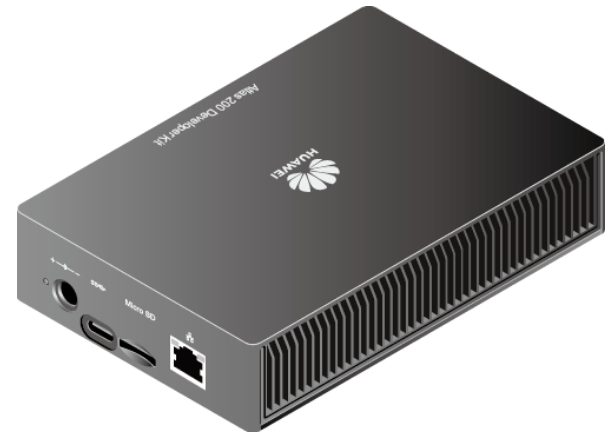
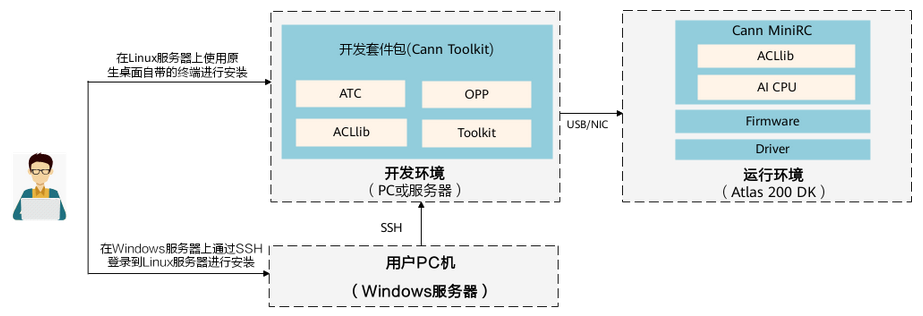
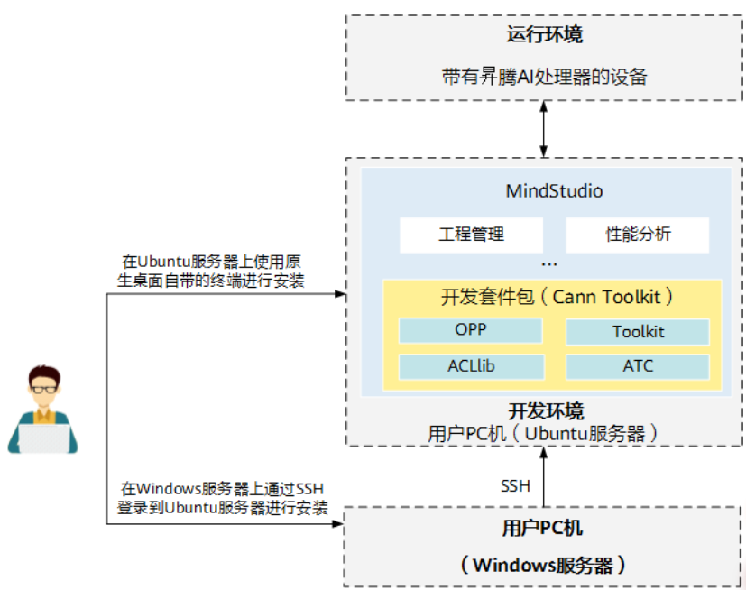
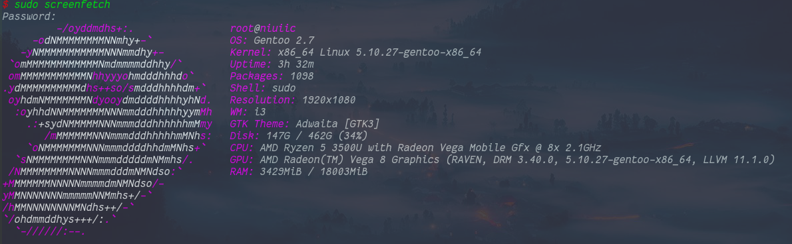
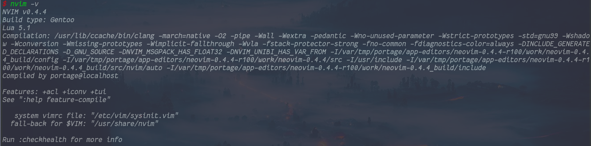
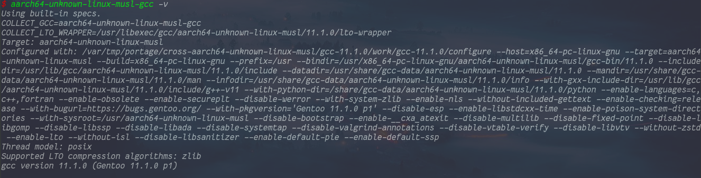
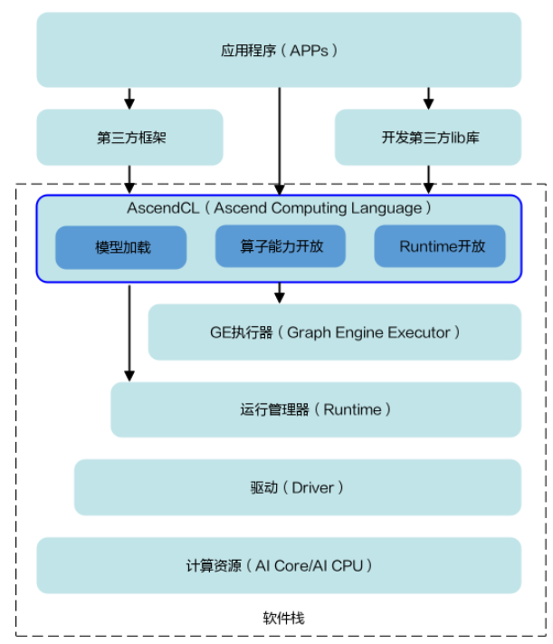
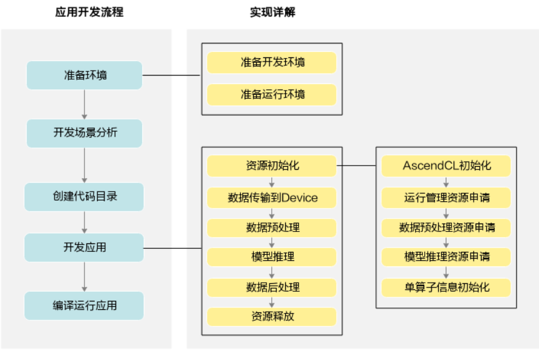

# Atlas 200 DK 人脸识别

本项目根据官方例程修改，支持从摄像头和本地视频识别已注册的人脸。适用于 20.1 版本套件包。

## 平台介绍

Atlas 200 DK 开发者套件（型号 3000）是以 Atlas 200 AI 加速模块（型号 3000）为核心的开发者板形态的终端类产品。其主要功能是方便用户快捷地使用 Atlas 200 AI 加速度模块（型号 3000）进行平安城市、无人机、机器人、视频服务器等众多领域的预研开发。

Atlas 200 AI 加速模块（型号 3000）是一款高性能的 AI 智能计算模块，集成了昇腾 310 AI 处理器（Ascend 310 AI 处理器），可以实现图像、视频等多种数据分析与推理计算，可广泛用于智能监控、机器人、无人机、视频服务器等场景。



平台技术规格参见[Atlas 200 DK 开发者套件官网](https://e.huawei.com/cn/products/cloud-computing-dc/atlas/atlas-200)。

平台特点与接口说明参见[Atlas 200 DK 文档](https://support.huaweicloud.com/productdesc-A200dk_3000_c75/atlas200_DK_pdes_19_0011.html)。

## 环境部署

### 准备配件

1.  64G SD 卡一张，推荐使用经过测试的 SD 卡
    - 三星 UHS-I U3 CLASS 10 64G
    - 金士顿 UHS-I U1 CLASS 10 64G
2.  读卡器
3.  Type-C 连接线
4.  树莓派摄像头，型号为 RASPBERRY PI V2.1。若使用 IT21DMDA 主板，还需要配备黄色的 15 pin 树梅派专用排线。

摄像头安装方式：[主板为 IT21DMDA](https://support.huaweicloud.com/dedg-A200dk_3000_c75/atlased_04_0006.html)，[主板为 IT21VDMB](https://support.huaweicloud.com/dedg-A200dk_3000_c75/atlased_04_0007.html)

### 开发与运行环境概述



正常情况下 Atlas 200 DK 的开发与运行都在 linux 系统上完成。当前版本（1.0.8.alpha）支持的 linux 版本为 ubuntu 18.04。

Atlas 200 DK 开发板本身作为运行环境（也可以同时作为开发环境），接受并运行由 linux 开发机编写，编译完成的程序。

开发者可以选择 linux 虚拟机、linux 物理机、本地 linux 服务器或者 Atlas 本身搭建开发环境。如果使用本地服务器，则需要使用 ssh 控制开发机。

> 以下均使用开发机表示开发环境，使用开发板表示运行环境。

### 搭建开发环境

Atlas 200 DK 使用 MindStudio 作为配套 IDE，该 IDE 基于 Jetbrains 的 IDEA，随功能强大，但资源消耗量亦很大。如果开发机性能不足，则不建议使用。以下为开发环境中 MindStudio 与 Cann Toolkit 架构图。



开发包组件功能如下。

- ACLlib：用来编译和运行应用程序。包含 AscendCL 编译依赖的相关库，并具有 GE 模型的加载、执行功能。
- ATC：模型和算子编译器。用于离线模型转换、自定义算子开发、IR 构图开发等场景。
- OPP：算子库，包含算子原型库及算子实现库、算子插件、融合规则。算子实现包含 TBE 算子、AICPU 算子，另外包含算子 parser。
- Toolkit：调测工具包，主要包含开发者调测应用、算子需要使用的工具包，例如：
  - Profiling：profiling 性能调试工具。
  - ADC：昇腾调试工具客户端，可以将命令发送到 Host 执行；也可以将文件传输到 Host。

为实现以上架构的搭建，首先需要安装 ubuntu18.04 系统。

#### 安装 ubuntu18.04

以安装虚拟机为例，说明安装流程。

首先安装虚拟机软件。可以选择 Virtual box 或 Vmware Workstation（建议安装最新版）。[Virtual box 安装教程](https://zhuanlan.zhihu.com/p/111567471)，[Vmware Workstation 安装教程](https://zhuanlan.zhihu.com/p/141033713)。

从镜像站下载 ubuntu 18.04 镜像。可以选择[阿里源](/http://mirrors.aliyun.com/ubuntu-releases/18.04.4/)。

下载`ubuntu-18.04.5-desktop-amd64.iso`。

根据以下教程安装 ubuntu 18.04。[Vmware Workstation 安装 ubuntu 18.04 教程](https://zhuanlan.zhihu.com/p/38797088)，[Virtual box 安装 ubuntu 18.04 教程](https://blog.csdn.net/wyplj2015/article/details/105362928)。

出现问题建议上网查询或者观看 Atlas 200 官方提供的[安装教程](https://support.huaweicloud.com/A200dk_3000_c75/)（环境部署-快速入门-安装视频教程参考）。

#### 获取开发者套件包

根据[文档](https://support.huaweicloud.com/dedg-A200dk_3000_c75/atlased_04_0023.html)的提示，安装 20.1 版本的套件包。

注意各版本套件包之间的兼容度不高，若是版本不对应，很可能导致程序出错。

#### 配置 ubuntu 系统

首先跳过[文档](https://support.huaweicloud.com/dedg-A200dk_3000_c75/atlased_04_0024.html#section1)中所有关于用户的设置。

用`nano`或者`vi`编辑`/etc/sudoers`，加入一行`username ALL=(ALL:ALL)`，其中 username 应当替换为自己的用户名。

由于互联网管制的限制，国内拉取 ubuntu 软件包的速度非常缓慢，需要先[设置国内镜像源](https://zhuanlan.zhihu.com/p/61228593)。

换源成功后，使用以下命令更新系统（注意只是更新软件版本，不可升级系统版本）。

```shell
sudo apt-get update
sudo apt-get upgrade
```

然后继续执行以下命令安装基础编译系统。

```shell
sudo apt-get install -y gcc g++ make cmake zlib1g zlib1g-dev libsqlite3-dev openssl libssl-dev libffi-dev unzip pciutils net-tools libblas-dev gfortran libblas3 libopenblas-dev
```

接下来配置 python 环境。使用以下命令安装 python3.7.5。

```shell
wget https://www.python.org/ftp/python/3.7.5/Python-3.7.5.tgz
tar -zxvf Python-3.7.5.tgz
cd Python-3.7.5
./configure --prefix=/usr/local/python3.7.5 --enable-loadable-sqlite-extensions --enable-shared
make
sudo make install
sudo ln -s /usr/local/python3.7.5/bin/python3 /usr/local/python3.7.5/bin/python3.7.5
sudo ln -s /usr/local/python3.7.5/bin/pip3 /usr/local/python3.7.5/bin/pip3.7.5
```

修改`~/.bashrc`文件，加入

```shell
#用于设置python3.7.5库文件路径
export LD_LIBRARY_PATH=/usr/local/python3.7.5/lib:$LD_LIBRARY_PATH
#如果用户环境存在多个python3版本，则指定使用python3.7.5版本
export PATH=/usr/local/python3.7.5/bin:$PATH
```

设置完成后检测以下 python3.7.5 是否成功安装。

```shell
python3.7.5 --version
pip3.7.5  --version
python3.7 --version
pip3.7  --version
```

若返回版本信息，则安装成功。

接下来安装 python 包。同理，python 包拉取也受到了限制。因此需要先[换源](https://blog.csdn.net/lambert310/article/details/52412059)。然后执行下面的命令。

```shell
pip3.7.5 install attrs --user
pip3.7.5 install psutil --user
pip3.7.5 install decorator --user
pip3.7.5 install numpy --user
pip3.7.5 install protobuf==3.11.3 --user
pip3.7.5 install scipy --user
pip3.7.5 install sympy --user
pip3.7.5 install cffi --user
pip3.7.5 install grpcio --user
pip3.7.5 install grpcio-tools --user
pip3.7.5 install requests --user
```

#### 安装开发者套件包

进入开发者套件包的所在的路径。使用以下命令安装。

```shell
chmod +x *.run
./Ascend-cann-toolkit_{version}_linux-x86_64.run  --check
./Ascend-cann-toolkit_{version}_linux-aarch64.run --check
./Ascend-cann-toolkit_{version}_linux-x86_64.run --install
./Ascend-cann-toolkit_{version}_linux-aarch64.run --install
```

check 是检验包的完整性，install 是安装，按以上命令在默认位置安装即可。

#### 安装交叉编译工具

一般开发机的架构为 amd64 或者说 x86_64，但是开发板的架构为 arm64。为 amd64 架构编译的程序不能在 arm64 下运行。在开发机上为不同架构的系统编译程序称为交叉编译，为此需要安装交叉编译工具链。

使用以下命令在开发机上安装交叉编译工具链。

```shell
sudo apt-get install g++-aarch64-linux-gnu
```

#### 配置环境变量

这一步的目的是告诉编译工具或者其他工具可用的工具、库、头文件的位置。

在`~/.bashrc`中加入以下内容。

```shell
export install_path=/home/HwHiAiUser/Ascend/ascend-toolkit/latest     # 以安装用户为HwHiAiUser为例
export PATH=${install_path}/atc/ccec_compiler/bin:${install_path}/atc/bin:${install_path}/toolkit/bin:$PATH
export LD_LIBRARY_PATH=${install_path}/acllib/lib64:${install_path}/atc/lib64:$LD_LIBRARY_PATH
export PYTHONPATH=${install_path}/atc/python/site-packages:${install_path}/atc/python/site-packages/auto_tune.egg/auto_tune:${install_path}/atc/python/site-packages/schedule_search.egg:${install_path}/toolkit/python/site-packages:${install_path}/pyACL/python/site-packages:$PYTHONPATH
export ASCEND_OPP_PATH=${install_path}/opp
```

注意需要将 HwHiAiUser 替换为自己的用户名。另外，如果之前没有按默认路径安装工具，上述配置很可能将不适用，需要按具体情况作出修改。

#### 安装 MindStudio（可选）

MindStudio 的安装与基础功能介绍可以参考[文档](https://support.huaweicloud.com/ug-mindstudioc75/atlasms_02_0191.html)。

由于虚拟机性能不高，此处暂时放弃使用 MindStudio，之后另介绍一种开发方式。

#### 部署 Media 模块

Media 模块是开发者板驱动包，包含 OS 外围软件、AI 软件栈、维测相关软件及驱动。如果要使用 Atlas 200 DK 摄像头等外设，就需要在开发机上部署该包，用于满足编译所需。

从[固件与驱动下载中心](https://www.hiascend.com/hardware/firmware-drivers?tag=community)下载 20.1 版本的`A200dk-npu-driver-20.1.0-ubuntu18.04-aarch64-minirc.tar.gz`，然后将其解压后的`driver`目录放到`～/Ascend`下即可。

### 搭建运行环境

#### 制卡

将 SD 卡插入读卡器，然后连接到开发机。

参考[文档](https://support.huaweicloud.com/dedg-A200dk_3000_c75/atlased_04_0013.html)中软件包准备部分，下载所需包。

然后在开发机中执行`su`，输入密码登陆到 root 用户，然后再执行以下命令。

```shell
apt-get update
pip3 install pyyaml
apt-get install qemu-user-static binfmt-support python3-yaml gcc-aarch64-linux-gnu g++-aarch64-linux-gnu
mkdir /home/username/mksd
```

注意`mkdir /home/username/mksd`中的 username 换成自己的用户名。将以上下载的所有文件移动到`/home/username/mksd`目录下。

进入该目录，再执行。

```shell
wget https://gitee.com/ascend/tools/raw/master/makesd/for_1.0.8.alpha/make_sd_card.py
wget https://gitee.com/ascend/tools/raw/master/makesd/for_1.0.8.alpha/make_ubuntu_sd.sh
```

使用`fdisk -l`查看当前设备中的存储分区情况。一般可以看到一个`/dev/sda`的设备，这就是已连接的 SD 卡。如果不是`sda`，也可能是`sdb`。通过查看该分区的大小就可以判断是否是 SD 卡。

找到 SD 卡后执行`python3 make_sd_card.py local /dev/sda`制卡，注意要将`/dev/sda`换成实际值。

如果没有意外，此时已经完成 SD 卡的制作，将其插入开发板中，启动开发板即可。如果有问题，可以参考[文档](https://support.huaweicloud.com/dedg-A200dk_3000_c75/atlased_04_0013.html)。

#### 部署 PyACL

[下载 PyACL 软件包](https://obs-9be7.obs.cn-east-2.myhuaweicloud.com/turing/resource/atlas200dk/20.1/Ascend-pyACL-20.1.rc1-linux.aarch64.run)

将该软件包上传到开发板。`rysnc -avz -P path1 HwHiAiUser@192.168.1.2:path2`。其中`path1`是该软件包在开发机上的路径，`path2`是软件包传到开发板上的路径。

使用 ssh 登陆到开发板，进入软件包所在目录，使用`chmod +x ./xxx`授予软件包权限（xxx 为软件包名称）。然后使用`./xxx --install --run`安装软件包。

最后，在`~/.bashrc`中添加环境变量`export PYTHONPATH=/home/HwHiAiUser/Ascend/pyACL/python/site-packages/acl`。

执行以下命令或者重新登陆开发板使环境变量生效。

```
source /home/HwHiAiUser/.bashrc
```

### 连接开发机与开发板

开发板可以通过多种方式连接开发机，本质上是为了建立一个联系通道。

常见的连接方式有网线连接、数据线连接、无线网络连接、通过路由器连接。

这里介绍最保险的连接方式，通过数据线连接。

首先，用数据线将开发板与开发机连接。接下来需要建立开发板与开发机之间的 ssh 通道。

为了建立该通道，首先需要使两者处于一个网段之下。举个简单的例子，如`192.168.1.108`与`192.168.1.109`处于同一个网段，它们的前三位都是一样的。

开发板默认的网络 ip 为`192.168.1.2`，因此需要将开发机的 ip 设置为`192.168.1.xxx`。

首先在开发机上使用`ip a`查看网络 ip（一般是除了`127.0.0.1`之外的唯一一个 ip）。如果当前 ip 地址就是`192.168.1.xxx`，则无法设置开发机与开发板建立连接。因为虽然都是`192.168.1`，但两者并不是在同一层。这种情况下，要么改变开发机的 ip，（如虚拟机一般只需要将网络连接方式改为 NAT 即可），要么改变开发板的 ip（可在[制卡阶段修改](https://support.huaweicloud.com/dedg-A200dk_3000_c75/atlased_04_0013.html)，也可仿照以下方法手动修改。

为了不影响开发机正常上网，不改变开发机原有的 ip，而是为其增加一个和开发板同网段的 ip。

1. 手动修改方式如下。

先使用`ip a`查看 USB 网卡名称。（可以在连接和不连接开发板的情况下都执行一下，找到多出来的那个接口）

编辑`/etc/netplan/01-netcfg.yaml`，修改其内容如下。

```yaml
network:
  renderer: networkd
  ethernets:
    enp0s20f0u4:
      dhcp4: no
      addresses: [192.168.1.223/24]
      gateway4: 192.168.0.1
      nameservers:
        addresses: [255.255.0.0]
```

注意`addresses`部分的网段是否和开发板符合，并用自己的网卡名称替换`enp0s20f0u4`。

修改完成后执行`netplan apply`重启网络。

查看是否可以通过`ping 192.168.1.2`获取数据。如果可以，再尝试使用`ssh HwHiAiUser@192.168.1.2`登陆到开发板。

如果需要，可以使用`passwd HwHiAiUser`和`passwd root`修改开发板用户密码。

### 开发板联网

开发板通过数据线连接到开发机后，可以通过开发机路由上网。

该方法的原理是将开发机作为路由器，将数据线作为网线。

首先，在开发机上用`su`登陆 root 账户。执行`echo "1" > /proc/sys/net/ipv4/ip_forward`。如果显示目录不存在，则先执行`mkdir -p /proc/sys/net/ipv4/`，然后再重新执行一遍。

```shell
sudo iptables -t nat -A POSTROUTING -o enp2s0 -s 192.168.1.0/24 -j MASQUERADE
sudo iptables -A FORWARD -i enp0s20f0u8 -o enp2s0 -m state --state RELATED,ESTABLISHED -j ACCEPT
```

其中`enp0s20f0u8`是 USB 网卡接口，`enp2s0`是开发机联网的接口。

在开发板上执行`sudo ip route add default via 192.168.1.251 dev usb0`。其中`192.168.1.251`是虚拟网卡的 ip 地址，也就是之前为开发机手动添加的那个 ip 地址。`usb0`是开发板上 USB 虚拟网卡接口，注意查看是否是该名称。

然后，再配置开发板的 DNS。编辑`/etc/resolvconf/resolv.conf.d/base`，添加`nameserver 114.114.114.114`。然后执行`resolvconf -u`。

此时，开发板已经可以上网。不过当开发板重启时需要在两边重复刚才的步骤才可重新接入网络。

### 配置开发工具

如果开发机性能不足以运行 MindStudio，建议使用以下方案。

#### 编辑环境搭建

在使用虚拟机作为开发机的情况下，由于开发机性能不足，使用 MindStudio 作为 IDE 进行开发非常容易卡机。为了弥补性能的不足，将项目的编辑与编译环节分离。项目编辑转移到主机或者其他电脑（以下假设使用主机），编译仍然使用开发机。

要剥离编辑环节，就要向主机提供编辑所需的环境。该环境包含内容如下。

- 各种头文件、库文件
- 编译工具链

头文件与库文件只需要复制开发机主目录下（如果安装时使用默认路径的话）的`Ascend`、`ascend_ddk`目录到主机即可。

编译工具链可以在网上下载 aarch64 gcc 编译链。

准备好这些之后，选用 vscode 作为编辑器来编写代码。在其中安装各种语言所需插件，设置头文件路径、编译链路径。就可以达到代码自动补全、代码格式化、代码逻辑检查等功能。

vscode 的安装配置可以在网上找教程，如[教程示例](https://zhuanlan.zhihu.com/p/87864677)。

如果觉得 vscode 配置起来比较麻烦，可以选用其他编辑器，或者 IDE，如 jetbrains 的 Clion 等。如果选择 IDE，尤其是 jetbrains 系列的 IDE，要在编辑的同时打开虚拟机，电脑内存最好在 16G 及以上。

如果对 vim 比较熟悉，可以尝试使用 vim/neovim 作为编辑器开发项目。如果不熟悉，最好果断放弃。此外如果主机是 windows 系统，不推荐使用 vim。

如果有兴趣将 vim 打造成比 IDE 更强大的多语言编辑器，可以参考[我的博客](https://www.niuiic.top/categories/Vim/)。

搭建好编辑环境之后，就可以开始编辑代码。编辑器不会提供新建项目的功能，如果要新建项目，按照项目的目录结构搭建即可。建议先从 gitee 拷贝官方例程，进行修改。

#### 从编辑到编译

现在编辑和编译环境已经分离，编辑完成后要进行编译，必须先把写好的代码上传到开发机。该步骤有多种实现方案，推荐以下两个方案。

1. 直接拷贝

因为是使用虚拟机，直接将代码从主机拷贝到虚拟机然后执行编译命令是最简单，也是相当快速的方法。

2. 使用 git

git 是分布式版本控制工具。大小项目的管理通常都使用 git 及其它类似的工具。要实现以上功能，只需在主机将写好的代码推送到远程仓库，然后在开发机上拉取远程仓库的代码即可。

使用该方案的好处是可以方便的管理项目，对于初学者而言，可能最重要功能的就是版本的回滚与多分支。当因为在正确的代码上为添加功能而引入错误，又实在改不回去时，回滚可以节省相当多的时间。多分支的结构允许在 main 分支上保存稳定的版本，然后在其余分支上进行修改，直到再次稳定后合并到 main 分支，确保修改代码的尝试不至于损害之前的劳动成果。

git 的初步使用可以参考[git 入门教程](https://www.liaoxuefeng.com/wiki/896043488029600)。

#### 案例

下面以我的开发环境为例，说明一下部署与流程。

- 操作系统
  
- 编辑器
  
- 编译链
  

将`Ascend`和`ascend_ddk`拷贝到`~/Ascend`和`~/ascend_ddk`。

将项目拷贝到本地。`git clone https://github.com/niuiic/face_recognition`。

执行以下命令。

```shell
export DDK_PATH=$HOME/Ascend/ascend-toolkit/latest/arm64-linux
export NPU_HOST_LIB=$DDK_PATH/acllib/lib64/stub
mkdir build
cd build
cmake .. -DCMAKE_BUILD_TYPE=Release -DCMAKE_C_COMPILER=aarch64-unknown-linux-musl-gcc -DCMAKE_CXX_COMPILER=aarch64-unknown-linux-musl-g++
compiledb -n make
```

此时会产生一个`compile_commands.json`，该文件是`clangd`（C 和 C++的语言服务器）工作的配置文件。将该文件放到项目根目录下，即可使`clangd`正确工作。

使用 neovim 打开一个 cpp 文件，已经可以正确启动所有功能。（neovim 配置略）

编写代码，然后推送到 github 远程仓库。

```shell
git add .
git commit -m "update"
git pull origin main
git push origin main
```

编写一个编译脚本。

```shell
# build.sh
ssh niuiic@192.168.1.106 "cd ~/AscendProjects/samples/cplusplus/level2_simple_inference/n_performance/1_multi_process_thread/face_recognition_camera && ./make.sh" > ./build.log 2>&1
sed -i "s/fatal/%ERROR% fatal/g" ./build.log
sed -i "s/\/home\/niuiic\/AscendProjects\/samples\/cplusplus\/level2_simple_inference\/n_performance\/1_multi_process_thread\/face_recognition_camera/\/home\/niuiic\/Documents\/Project\/Cpp\/face_recognition/g" ./build.log
sed -i "s/warning/%WARNING%/g" ./build.log
sed -i "s/error/%ERROR%/g" ./build.log
cat ./build.log
```

该脚本通过 ssh 通道控制开发机拉取 git 仓库，然后完成编译，并且把输出的信息返回，然后修改开发机上项目目录到本地目录。传给 neovim 的 quickfix 插件（具体可见[vim quickfix](https://www.niuiic.top/2021/04/17/vim-quickfix/)），然后插件会在 neovim 中自动定位到编译出错的位置，以达到在本地使用 IDE 的效果。

测试项目时，连接好开发机和开发板，在开发机上运行程序，检验效果。

比较使用 IDE 的方案，该方案下编辑所用电脑（非虚拟机主机）内存占用最高时不超过 4G（4G/18G），远低于使用 IDE 的消耗。且量身定制的 neovim 提供的编辑体验远超 IDE。

如果对本套方案感兴趣，可以查看[我的博客](https://www.niuiic.top/)。以下提供的链接不包含深度内容，相对容易入手。无基础情况下，想要真正了解并熟练运用 linux + vim 的开发模式至少需要折腾一年。

[gentoo linux 入门教程](https://www.niuiic.top/categories/Gentoo/)
[vim 配置教程](https://www.niuiic.top/categories/Vim/)
[vim 配置文件参考](https://github.com/niuiic/ultimate_neovim_configuration)

## 应用开发

### 接口与工具

Atlas 200 DK 开发套件为开发者提供了一套适配硬件加速的接口，用户可以按照[文档](https://support.huaweicloud.com/asdevg-c-A200dk_3000_c75/atlasdevelopment_01_0007.html)说明，和参考[例程](https://gitee.com/ascend/samples)进行调用。其逻辑架构图如下。



可以看出 AscendCL 主要是对底层进行了优化，而不限制顶层框架的使用。用户可以根据需求选择支持 AscendCL 的第三方框架或者自己编译第三方库。然而，目前可供使用的第三方框架的类型和版本都还比较有限。

### 开发流程

项目开发流程如下图所示。



来看最关键的开发应用阶段。该阶段的流程就是整个应用的运行过程。以人脸识别为例，该流程可以具化为以下部分。

1. 资源初始化：开辟数据存储空间，申请运行管理资源，初始化模型、摄像头等
2. 数据传输到 Device：将摄像头拍摄得到的视频流传输到原始数据存储空间
3. 数据预处理：将视频转化为一帧帧的图片，修正到模型可以接受的大小，去除无效元素，修正人脸（将人脸裁剪出来，摆正等）。
4. 模型推理：使用模型进行人脸的检测、特征遮罩、识别。
5. 数据后处理：将识别结果传输到显示模块可以调取的位置。用于前端显示。
6. 资源释放：在程序运行过程中及时释放已经无用的资源，人脸识别结束后释放所有占用的资源。

## 人脸识别项目

### 人脸识别技术简介

人脸识别是指能够识别或验证图像或视频中的主体的身份的技术。

传统的人脸识别方法依赖人工设计的人脸特征（如边、纹理描述量等）与机器学习技术的组合。能针对各种不同的变化类型（如头部姿势、年龄、光照、表情、遮挡等）采取不同的应对方法。

现在的人脸识别方法已经被基于卷积神经网络（CNN）的深度学习方法接替。该学习方法的主要优势是它们可以使用非常大型的数据集进行训练，从而学习到表征这些数据的最佳特征。

人脸识别系统通常由以下模块组成。

- 人脸检测。人脸检测器用于寻找图像中人脸的位置，如果有人脸，就返回包含每张人脸的边界框的坐标。
- 人脸对齐。人脸对齐的目标是使用一组位于图像中固定位置的参考点来缩放和裁剪人脸图像。这个过程通常需要使用一个特征点检测器来寻找一组人脸特征点，在简单的 2D 对齐情况中，即为寻找最适合参考点的最佳仿射变换。
- 人脸表征。在人脸表征阶段，人脸图像的像素值会被转换成紧凑且可判别的特征向量，这也被称为模板。理想情况下，同一个主体的所有人脸都应该映射到相似的特征向量。
- 人脸匹配。在人脸匹配构建模块中，两个模板会进行比较，从而得到一个相似度分数，该分数给出了两者属于同一个主体的可能性。

### 项目介绍

- 功能：通过摄像头对视频中的人脸信息进行预测，对已经注册的人脸进行对比，检测出最可能的用户，然后显示用户注册名。
- 输入：摄像头或者本地 mp4 视频
- 输出：presenter 界面显示识别结果

### 项目流程

简化的项目流程如下图所示。

- 数据处理部分在上述开发流程中已经说明。
- 选择视频输入源之后，在任意步骤都可以通过 gui 上的 return 按钮返回到该步，开发板上运行的主程序会自动关闭。
- 按下 gui 上的 open browser 按钮可以自动打开 presenter 输出的浏览器页面。
- 人脸注册逻辑在 presenter server 上实现。


### 项目部署

#### 前提条件

首先确保已经按上述环境部署的步骤部署好开发已经运行环境。

确保开发板与开发机连接正常，摄像头安装正确。

#### 软件准备

1. 获取源码

在开发机上找到一个合适的目录，如`~/AscendProject`。

执行以下命令。

```shell
cd ~/AscendProject
git clone https://github.com/niuiic/face_recognition
```

2. 获取人脸识别模型

本项目使用官方例程提供的模型。如果想要自己训练，可以使用华为[ModelArts 平台](https://www.huaweicloud.com/product/modelarts.html)。训练完成后使用 atc 工具进行转换。

将模型放在项目根目录下的 model 目录下。

| 模型名称       | 模型说明               | 下载路径                                                                                                                                                                                   |
| -------------- | ---------------------- | ------------------------------------------------------------------------------------------------------------------------------------------------------------------------------------------ |
| face_detection | 人脸检测网络模型       | [下载地址](https://modelzoo-train-atc.obs.cn-north-4.myhuaweicloud.com/003_Atc_Models/AE/ATC%20Model/facedection/ssd-facedection_framework_caffe_aipp_1_batch_1_input_fp16_output_FP32.om) |
| vanillacnn     | 人脸特征点标记网络模型 | [下载地址](https://modelzoo-train-atc.obs.cn-north-4.myhuaweicloud.com/003_Atc_Models/AE/ATC%20Model/vanillacnn/vanillacnn_framework_caffe_aipp_0_batch_4_input_fp32_output_FP32.om)       |
| sphereface     | 特征向量获取网络模型   | [下载地址](https://modelzoo-train-atc.obs.cn-north-4.myhuaweicloud.com/003_Atc_Models/AE/ATC%20Model/sphereface/sphereface_framework_caffe_aipp_1_batch_8_input_fp32_output_FP32.om)       |

> 以上下载的模型需要改成表格内的名称，如`face_detection.om`。

如果以上模型已不可用，则按下述方法转化模型。

face_detection

下载[[1]](https://modelzoo-train-atc.obs.cn-north-4.myhuaweicloud.com/003_Atc_Models/AE/ATC%20Model/facedection/face_detection_fp32.caffemodel) [[2]](https://modelzoo-train-atc.obs.cn-north-4.myhuaweicloud.com/003_Atc_Models/AE/ATC%20Model/facedection/face_detection.prototxt) [[3]](https://modelzoo-train-atc.obs.cn-north-4.myhuaweicloud.com/003_Atc_Models/AE/ATC%20Model/facedection/insert_op.cfg)

执行

```shell
export install_path=$HOME/Ascend/ascend-toolkit/latest
export LD_LIBRARY_PATH=${install_path}/atc/lib64
atc --model=./face_detection.prototxt --weight=./face_detection_fp32.caffemodel --framework=0 --output=./face_detection --soc_version=Ascend310 --insert_op_conf=./insert_op.cfg
```

vanillacnn

下载[[1]](https://modelzoo-train-atc.obs.cn-north-4.myhuaweicloud.com/003_Atc_Models/AE/ATC%20Model/vanillacnn/vanillacnn.caffemodel) [[2]](https://modelzoo-train-atc.obs.cn-north-4.myhuaweicloud.com/003_Atc_Models/AE/ATC%20Model/vanillacnn/vanilla_deploy.prototxt)

执行

```shell
export install_path=$HOME/Ascend/ascend-toolkit/latest
export LD_LIBRARY_PATH=${install_path}/atc/lib64
atc --model=./vanilla_deploy.prototxt --weight=./vanillacnn.caffemodel --framework=0 --output=./vanillacnn_framework_caffe_aipp_0_batch_4_input_fp32_output_FP32 --soc_version=Ascend310
```

sphereface

下载[[1]](https://modelzoo-train-atc.obs.cn-north-4.myhuaweicloud.com/003_Atc_Models/AE/ATC%20Model/sphereface/sphereface.caffemodel) [[2]](https://modelzoo-train-atc.obs.cn-north-4.myhuaweicloud.com/003_Atc_Models/AE/ATC%20Model/sphereface/sphereface.prototxt) [[3]](https://modelzoo-train-atc.obs.cn-north-4.myhuaweicloud.com/003_Atc_Models/AE/ATC%20Model/sphereface/insert_op.cfg)

执行

```shell
export install_path=$HOME/Ascend/ascend-toolkit/latest
export LD_LIBRARY_PATH=${install_path}/atc/lib64
atc --model=./sphereface.prototxt --weight=./sphereface.caffemodel --framework=0 --output=./sphereface_framework_caffe_aipp_1_batch_8_input_fp32_output_FP32 --soc_version=Ascend310 --insert_op_conf=./insert_op.cfg
```

3. 安装 golang

项目 gui 使用 go 语言编写，需要 go 语言环境。

执行

```shell
wget https://golang.google.cn/dl/go1.16.3.linux-amd64.tar.gz
sudo tar xfz go1.16.3.linux-amd64.tar.gz -C /usr/local
```

编辑`~/.bashrc`

加入`export PATH=/usr/local/go/bin:$PATH`

执行

```
go env -w GO111MODULE="on"
go env -w GOPATH="/home/username/.go"
go env -w GOPROXY="https://goproxy.cn,direct"
```

4. 安装mplayer

需要 mplayer 对本地视频进行分辨率检测。（本地视频支持的分辨率为1280*720）

`sudo apt-get install mplayer`

5. 编译项目

退出当前终端模拟器。再新建一个模拟终端，回到项目目录（清除刚才设置的环境变量，防止产生冲突）。

在项目根目录下执行以下命令。

```shell
export DDK_PATH=$HOME/Ascend/ascend-toolkit/latest/arm64-linux
export NPU_HOST_LIB=$DDK_PATH/acllib/lib64/stub
mkdir -p build/intermediates/host
cd build/intermediates/host
make clean
cmake ../../../src -DCMAKE_CXX_COMPILER=aarch64-linux-gnu-g++ -DCMAKE_SKIP_RPATH=TRUE
make
```

回到项目根目录，继续执行以下命令。

```shell
cd gui
go mod init gui
go mod tidy
go build
```

### 项目运行

#### 配置

修改项目根目录下`scripts/param.conf`中的`presenter_server_ip`、`presenter_view_ip`。将其中改为开发机 USB 网卡 ip 地址，如`192.168.1.223`。

修改项目根目录下`gui/param.json`中的配置。以下为例子。

```json
{
  "presenter_server_path": "/home/niuiic/face_recognition/scripts/run_presenter_server.sh",
  "presenter_server_ip": "192.168.1.223",
  "presenter_server_port": "7009",
  "presenter_server_output_dir": "out",
  "develop_board_ip": "192.168.1.2",
  "develop_board_user": "HwHiAiUser",
  "develop_board_root_password": "a",
  "develop_board_project_path": "/home/HwHiAiUser/face_recognition_camera"
}
```

修改开发板下的`/etc/ssh/sshd_config`中的`PermitUserEnvironment`，将开头的注释符号去掉，然后设置其值为yes。

然后在开发板终端运行`echo $PATH`、`echo $LD_LIBRARY_PATH`。将输出值，也就是开发板中路径、库文件路径等环境变量的值。将这些值加入到`~/.ssh/environment`文件中。写法如`PATH=/bin:/usr/bin:/sbin`。

这一步的目的是让开发机使用ssh控制开发板执行命令时，可以识别到开发板的环境变量，这些环境变量是运行程序所必须的。

需要额外注意的是，一定要把所有变量都写入。否则重启开发板后，再用ssh连接时就会使用设置的这些环境变量。假设缺少了`/usr/bin`这一路径，则会无法使用`which`等命令。因为找不到这些命令的路径。如果发生这种情况，可以使用`/usr/bin/which`，也就是使用绝对路径来执行命令。然后把缺失的路径补回来。

另外，由于程序运行需要root权限，在gui程序中暂无法处理该问题，所以是使用root用户登录。也就是`.ssh/environment`需要放在root用户的主目录下。可以使用`su`登录root用户，然后使用`cd`，就可以进入root用户主目录。

务必确认设置完成后再重启开发板。

#### 运行

先将项目同步到开发板，如进行项目根目录上一级目录，然后执行

```
rsync -P -avz ./face_recognition HwHiAiUser@192.168.1.2:/home/HwHiAiUser
```

> 用户名、文件路径、ip 地址需要安装实际情况修改。

进入项目根目录。

```shell
cd ./gui
./gui
```

注意该项目 gui 只是为了方便操作，没有进行全方位的错误检测。如果出现问题导致程序崩溃，多半是配置文件出错。

如果要手动执行项目。则执行以下命令。

```shell
./scripts/run_presenter_server.sh
```

登陆到开发板，在项目根目录下执行。

```shell
cd out
# 使用摄像头
./main
# 使用本地视频
./main video_path
```

> video_path 为视频路径

#### 注意事项

- 必须先启动 presenter server，开发板上的人脸识别主程序才能正常启动。
- presenter server 为单例模式，同一时间只能启动一个实例。
- 当前界面中设置点击 go 后等待 5 秒进入选择界面，以确保 presenter server 完全启动。但是第一次打开主程序（如点击 camera）时，浏览器页面中不存在`face detection`通道。此时 presenter server 与主程序均已经启动，但似乎连接有问题。目前暂未发现该问题源头，手动解决可以点击 return 返回后重进。
- 模型的效果并不好，需要调整好角度才可识别。
- 如果出现浏览器中有通道，但是无法正常显示视频等问题，建议重启开发机与开发板后重试。
- 如果无法找到摄像头，建议换一个接口试一下。
